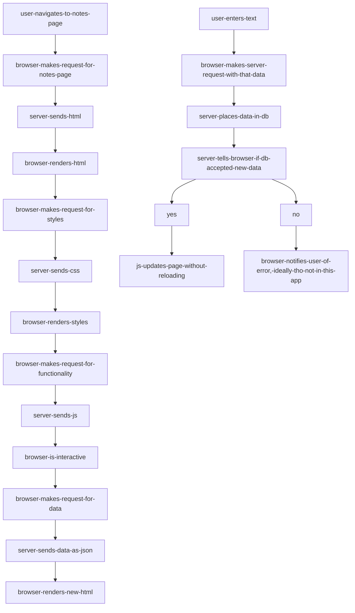

```mermaid
  graph TD;
      user-navigates-to-notes-page-->
      browser-makes-request-for-notes-page-->
      server-sends-html-->
      browser-renders-html-->
      browser-makes-request-for-styles-->
      server-sends-css-->
      browser-renders-styles-->
      browser-makes-request-for-functionality-->
      server-sends-js-->
      browser-is-interactive-->
      browser-makes-request-for-data-->
      server-sends-data-as-json-->
      browser-renders-new-html;
      user-enters-text-->
      browser-makes-server-request-with-that-data-->
      server-places-data-in-db-->
      server-tells-browser-if-db-accepted-new-data-->
      yes-->
      js-updates-page-without-reloading;
      server-tells-browser-if-db-accepted-new-data-->
      no-->
      browser-notifies-user-of-error,-ideally-tho-not-in-this-app;

```
